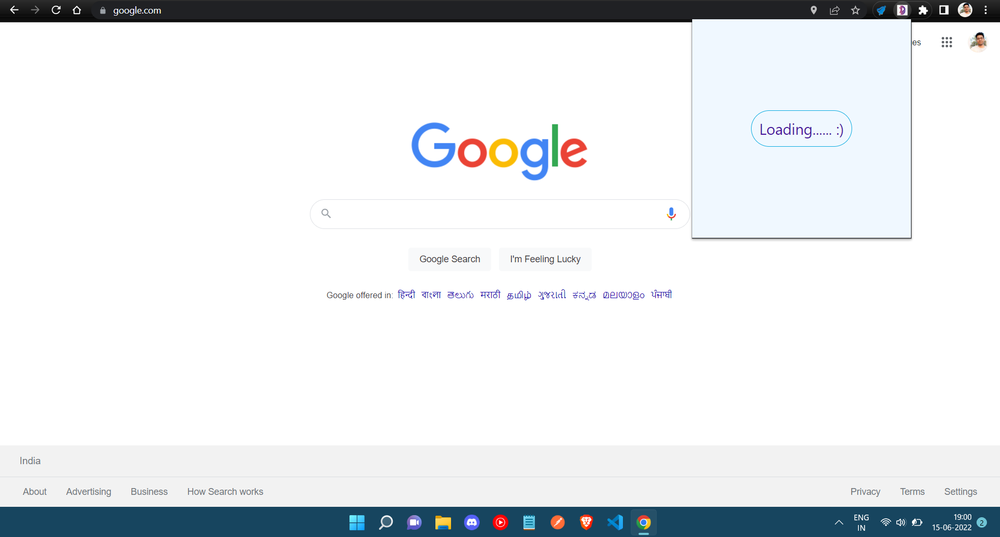

# Bad Jokes :)
A chrome Extension for generating jokes. Used API for generating all new jokes whenever its clicked!

## Badges

Add badges from somewhere like: [shields.io](https://shields.io/)

## Screenshot

